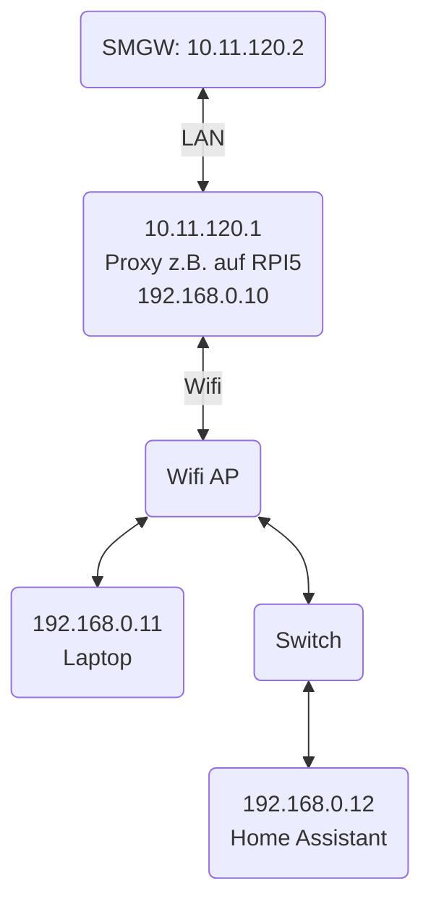

# Reverse Proxy für ein Smart Meter Gateway

Der Einbau eines Smart Meter Gateways (z.B. ein Theben Conexa) erfolgt durch den Messstellenbetreiber. Das SMGW hat einen Ethernet-Port, den man mit dem häuslichen LAN verbinden kann. In der Sprache der Energiewirtschaft ist das der HAN-Port (HAN = Home Area Network).

Dabei hat der Endkunde keinen Einfluss auf die Vergabe der IP-Adresse für den HAN-Port. Derzeit scheint es auch die Praxis zu geben, dass viele Messstellenbetreiber die SMGW mit einer festen IP-Adresse in einem beliebigen Subnetz ausliefern. Diese IP-Adresse wird nicht mit dem Haus- oder Wohnungseigentümer abgestimmt. Auch die Nutzung des DHCP-Protokolls zur dynamischen IP-Adressvergabe ist leider kein Standard in der Energiewirtschaft.

Das bedeutet, dass man sich als Haus- oder Wohnungseigentümer Gedanken machen muss, wie man den HAN-Portal erreichen kann. Die Erläuterung der SMGW-Hersteller ist nutzlos, weil sie vorsieht, dass man den eigenen Computer in das Subnetz des HAN-Ports verbinden muss. Damit kann der Computer nicht gleichzeitig für anderen Dienste genutzt werden. Zudem kann man mit dieser Konfiguration das SMGW nicht von einem Heimautomationssystem transparent über TCP erreichen.

Für eine transparente Erreichbarkeit kann man jedoch  ein Zusatzgerät vor das SMGW schalten, wie z.B. einen Raspberry Pi. Das könnte so aussehen:



(Die IP-Adressen sind beispielhaft angegeben.)

In diesem Repository liegt der Code für einen Proxy in der Programmiersprache GO. Er wird folgendermassen auf einem Raspberry Pi installiert (z.B. mit PI OS als Betriebssystem):

```shell
sudo apt update && sudo apt upgrade -y
sudo apt install golang git -y


```
