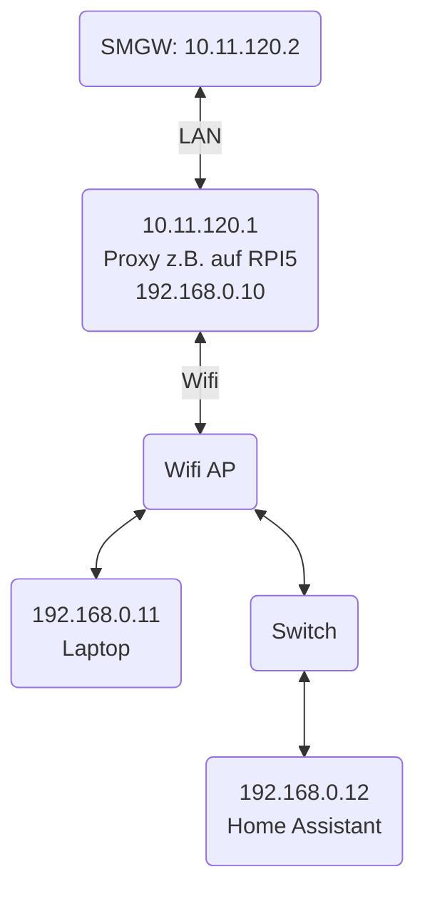

# Reverse Proxy für ein Smart Meter Gateway

Der Einbau eines Smart Meter Gateways (z.B. ein Theben Conexa) erfolgt durch den Messstellenbetreiber. Das SMGW hat einen Ethernet-Port, den man mit dem häuslichen LAN verbinden kann. In der Sprache der Energiewirtschaft ist das der HAN-Port (HAN = Home Area Network).

Dabei hat der Endkunde keinen Einfluss auf die Vergabe der IP-Adresse für den HAN-Port. Derzeit scheint es auch die Praxis zu geben, dass viele Messstellenbetreiber die SMGW mit einer festen IP-Adresse in einem beliebigen Subnetz ausliefern. Diese IP-Adresse wird nicht mit dem Haus- oder Wohnungseigentümer abgestimmt. Auch die Nutzung des DHCP-Protokolls zur dynamischen IP-Adressvergabe ist leider kein Standard in der Energiewirtschaft.

Das bedeutet, dass man sich als Haus- oder Wohnungseigentümer Gedanken machen muss, wie man den HAN-Portal erreichen kann. Die Erläuterung der SMGW-Hersteller ist nutzlos, weil sie vorsieht, dass man den eigenen Computer in das Subnetz des HAN-Ports verbinden muss. Damit kann der Computer nicht gleichzeitig für anderen Dienste genutzt werden. Zudem kann man mit dieser Konfiguration das SMGW nicht von einem Heimautomationssystem transparent über TCP erreichen.

Für eine transparente Erreichbarkeit kann man jedoch  ein Zusatzgerät vor das SMGW schalten, wie z.B. einen Raspberry Pi. Das könnte so aussehen:



## Netzwerkkonfiguration

### wlan0: WLan Netzwerkport des Raspberry Pi

Der Raspberry Pi wird im Heim-Wlan registriert (z.B. über die Fritzbox). Die dynamisch vergebene IP-Adresse wird dann die Adresse, über die das SMGW zukünftig erreicht werden kann. Es wird empfohlen das Gerät in der Fritzbox so zu konfigurieren, dass es immer dynamisch [die gleiche IP-Adresse zugewiesen bekommt](https://fritz.com/service/wissensdatenbank/dok/FRITZ-Box-7590/201_Netzwerkgerat-immer-die-gleiche-IP-Adresse-von-FRITZ-Box-zuweisen-lassen/). Für andere Wlan-Systeme gelten andere Verfahren.


### eth0: LAN-Netzwerkport des Raspberry Pi 

Der LAN-Netzwerkport des Raspberry Pi wird direkt mit einem LAN-Kabel verbunden mit dem HAN-Port des SMGW. Der Port bekomme in Linux einer festen IP-Adresse im selben Subnetz wie das SMGW 

Im Beispiel hier: 
- Das SMGW hat vom Messstellenbetreiber fest die ``10.11.120.2`` bekommen
- Der LAN-Netzwerkport des Raspberry Pi bekommt die feste IP ``10.11.120.1``

Die Konfiguration in Raspberry Pi OS kann wie folgt durchgeführt werden:

```shell
sudo nano /etc/dhcpcd.conf
```

Am Ende der Datei Folgendes hinzufügen:

```shell
sudo nmcli con show
# Suche die Verbindung für eth0, z. B. „Wired connection 1“. Dann:
sudo nmcli con mod "Wired connection 1" ipv4.addresses 10.11.120.1/24
sudo nmcli con mod "Wired connection 1" ipv4.method manual
sudo nmcli con mod "Wired connection 1" ipv4.gateway ""
sudo nmcli con mod "Wired connection 1" ipv4.dns "8.8.8.8 8.8.4.4"
sudo nmcli con down "Wired connection 1" 
sudo nmcli con up "Wired connection 1"
```

Dann Raspberry Pi neu starten:

```shell
sudo reboot
```

## Source Code für den Proxy

In diesem Repository liegt der Code für einen Proxy in der Programmiersprache GO in der Datei ``reverse_proxy.go``. Er wird folgendermassen auf einem Raspberry Pi installiert (z.B. mit PI OS als Betriebssystem):

```shell
# Linux aktualisieren und GO installieren
sudo apt update && sudo apt upgrade -y
sudo apt install golang git -y

# Go-Proxy kompilieren
git clone https://github.com/klacol/smgw-proxy
cd smgw-proxy
```

Um den reverse_proxy nach jedem Neustart automatisch zu starten und die Logs einzusehen, empfiehlt sich ein systemd-Service. So geht’s:

Erstelle eine systemd-Service-Datei, z. B. ``/etc/systemd/system/reverse_proxy``.service:

Füge Folgendes ein (Pfad und User ggf. anpassen):

```shell 
[Unit]
Description=Reverse Proxy für SMGW
After=network-online.target

[Service]
ExecStart=/home/pi/smgw-proxy/reverse_proxy -logdir /var/log/smgw-proxy
WorkingDirectory=/home/pi/smgw-proxy
Restart=always
User=pi
StandardOutput=journal
StandardError=journal

[Install]
WantedBy=multi-user.target
```

Service aktivieren und starten:

```shell 
sudo timedatectl set-timezone Europe/Berlin
sudo systemctl daemon-reload
sudo systemctl enable reverse_proxy
sudo systemctl start reverse_proxy
```


Proxy aktualisieren

```shell
# Go-Proxy kompilieren
cd smgw-proxy
git pull
go build -o reverse_proxy reverse_proxy.go
sudo systemctl restart reverse_proxy
journalctl -u reverse_proxy -f
```

## Log-Dateien

Der Proxy unterstützt das Speichern von Log-Dateien mit automatischer Rotation. Standardmäßig werden die Logs alle 24 Stunden rotiert, wobei alte Log-Dateien für bis zu 3 Tage aufbewahrt werden.

### Konfiguration der Log-Dateien

Der Proxy kann mit folgenden Parametern für das Logging konfiguriert werden:

```shell
./reverse_proxy -logdir /var/log/smgw-proxy -logfile proxy.log
```

**Parameter:**
- `-logdir`: Verzeichnis zum Speichern der Log-Dateien (Standard: ./logs)
- `-logfile`: Name der Log-Datei (Standard: proxy.log)

Das Log-Verzeichnis wird automatisch erstellt, falls es nicht existiert. Die Log-Dateien werden mit Zeitstempel im Format `YYYY-MM-DD_HH-MM-SS_proxy.log` gespeichert und nach 24 Stunden automatisch rotiert.

### Zugriff auf die Log-Dateien

Die Log-Dateien können direkt im angegebenen Verzeichnis eingesehen werden:

```shell
ls -la /var/log/smgw-proxy
cat /var/log/smgw-proxy/2025-09-20_12-00-00_proxy.log
```

Wenn der Proxy als systemd-Service konfiguriert ist, werden die Logs zusätzlich auch im Journal gespeichert und können mit `journalctl` abgerufen werden:

```shell
journalctl -u reverse_proxy -f
```

## Trust On First Use (TOFU) für TLS-Verbindungen

Der Proxy unterstützt Trust On First Use (TOFU) für sichere TLS-Verbindungen mit dem Smart Meter Gateway. Dies ist besonders wichtig, da viele SMGW nur über HTTPS erreichbar sind und selbstsignierte Zertifikate verwenden.

### Was ist TOFU?

TOFU (Trust On First Use) ist ein Sicherheitskonzept, bei dem bei der ersten Verbindung zu einem Server dessen Zertifikat automatisch als vertrauenswürdig akzeptiert und gespeichert wird. Bei allen nachfolgenden Verbindungen wird das vom Server präsentierte Zertifikat mit dem gespeicherten verglichen. Dies bietet Schutz vor Man-in-the-Middle-Angriffen, ohne dass Zertifikate manuell installiert werden müssen.

### Funktionsweise

1. **Erste Verbindung**: Bei der ersten Verbindung zum SMGW wird das Zertifikat akzeptiert und in einem konfigurierbaren Verzeichnis gespeichert.
2. **Folgende Verbindungen**: Bei allen nachfolgenden Verbindungen wird das präsentierte Zertifikat mit dem gespeicherten verglichen.
3. **Zertifikatswechsel**: Wenn sich das Zertifikat ändert, wird die Verbindung abgelehnt und eine Warnmeldung ausgegeben. Dies könnte auf einen Man-in-the-Middle-Angriff hindeuten oder darauf, dass das Zertifikat erneuert wurde.

### Konfiguration

Der Proxy kann mit dem Parameter `-certdir` konfiguriert werden, um das Verzeichnis für die TOFU-Zertifikatsspeicherung anzugeben:

```shell
./reverse_proxy -target 10.11.120.2 -port 8080 -certdir ./zertifikate
```

**Parameter:**
- `-target`: IP-Adresse des HAN-Ports des Smart Meter Gateways (Standard: 10.11.120.2)
- `-port`: Port, auf dem der SMGW-Proxy lauschen soll (Standard: 8080)
- `-certdir`: Verzeichnis zum Speichern der TOFU-Zertifikate (Standard: ./certs)

### Sicherheitshinweise

- Das TOFU-Prinzip bietet eine gute Sicherheit, wenn die erste Verbindung nicht manipuliert wurde.
- Wenn Sie eine Warnmeldung über ein geändertes Zertifikat erhalten, sollten Sie dies überprüfen:
  - Bei einem legitimen Zertifikatswechsel: Löschen Sie die gespeicherte Zertifikatsdatei im Zertifikatsverzeichnis.
  - Bei Verdacht auf einen Angriff: Überprüfen Sie Ihre Netzwerksicherheit.

## Aufrufen:

Das SMGW sollte nun unter der IP-Adresse erreichbar sein, die der WLan Netzwerkport des Raspberry Pi bekommen hat. Der Standardport ist 8080. 

z.B. http://192.168.0.101:8080/

Das sieht dan z.Bm im Browser (nach Eingabe der Zugangsdaten) so aus:


Die Requests werden im Log ausgegeben. Das Log kann auf dem Raspberry Pi so eingesehen werden:

```shell 
journalctl -u reverse_proxy -f
```

## Nutzung in Home Assistant:

Nutze nun das SMGW in Home Assistant auf Basis [dieser Anleitung](https://github.com/jannickfahlbusch/ha-ppc-smgw?tab=readme-ov-file#configuration).

* URL = http://192.168.0.101:8080/smgw/m2m/ETHE0300186023.sm/json
* Username = ****
* Password = ***
* Update Interval = 1

## Hinweis

Diese Anleitung ist insgesamt viel zu komplex für einen normaler deutschen Menschen, der einfach nur das SMGW für seine Energiewende nutzen will. Daher sollten die Messstellenbetreiber IMHO die SMGW's so ausliefern, dass sie für normale Menschen nutzbar sind. Dazu müssen sie DHCP aktiviert haben am HAN/LAN-Port.